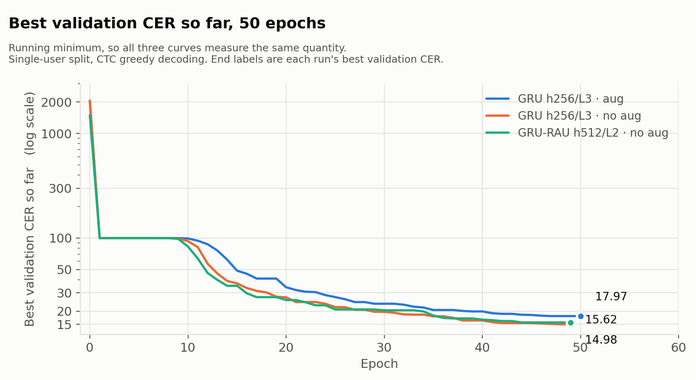
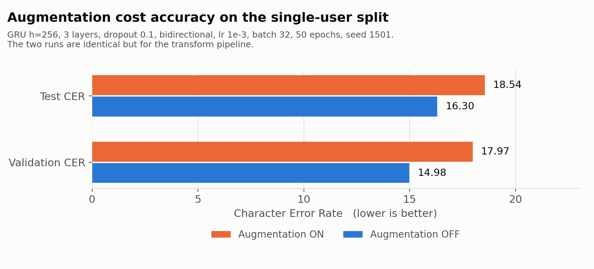

# sEMG keystroke decoding — GRU and GRU-RAU arms

Decoding QWERTY keystrokes from surface electromyography (sEMG) with recurrent
sequence models trained under CTC loss, on Meta's [emg2qwerty](https://github.com/facebookresearch/emg2qwerty)
dataset. This repository holds my two architecture arms from a four-person UCLA
ECE C247A final project: a **bidirectional GRU encoder** and a **GRU with a
temporal attention block** (RAU-inspired).

**Best test CER 16.30 (val 14.98)** — bidirectional GRU, 50 epochs, greedy CTC decoding, no language model, single-participant split.

Every number below traces to a file in this repository. Numbers that appeared in
the course report but whose run artifacts were not kept are **not** reported here —
see [Relationship to the course report](#relationship-to-the-course-report).

---

## Authorship and scope

This was a group project. **This repository contains only my work.**

| arm | author | where |
|---|---|---|
| **GRU encoder (`RNN-GRU`)** | **Justin Calderon** | this repo, branch `rnn-gru` |
| **GRU + temporal attention (`GRU-RAU`)** | **Justin Calderon** | this repo, branch `gru-rau` |
| RNN-LSTM | Valen Dunn | [group repo, branch `RNN-LSTM`](https://github.com/kmoses02/emg2qwerty_FinalProject/tree/RNN-LSTM) |
| CNN + RNN-LSTM | Katie Moses | [group repo, branch `CNN-LSTM`](https://github.com/kmoses02/emg2qwerty_FinalProject/tree/CNN-LSTM) |
| Inception-GRU | Beatrice Leung | [group repo, branch `Inception-GRU`](https://github.com/kmoses02/emg2qwerty_FinalProject/tree/Inception-GRU) |

My teammates' architectures are described in the report but their code is **not
included here** and is not mine to redistribute. Their branches are linked above.

Commit history is preserved: the `rnn-gru` and `gru-rau` branches carry the
original commits, authored under my name, from the group repository.

---

## Task and setup

- **Data** — emg2qwerty, `single_user` configuration: 16 training sessions, 1
  validation session, 1 test session, all from one participant.
- **Input** — 2 bands × 16 electrode channels, log-spectrogram features
  (`n_fft=64`, `hop_length=16`) → 528 input features.
- **Shared front end** — spectrogram normalization → multi-band
  rotation-invariant MLP (384) → flatten.
- **Encoder** — the arm under test.
- **Output** — linear → log-softmax over the character set, trained with **CTC
  loss**, decoded **greedily** (no language model, no beam search).
- **Metric** — Character Error Rate (CER), lower is better.
- **Training** — Adam, lr 1e-3, linear warmup (10 epochs) + cosine annealing,
  batch 32, 50 epochs, seed 1501, one A100 (~20 s/epoch).

---

## Results

All three runs: 50 epochs, batch 32, lr 1e-3, dropout 0.1, bidirectional, seed 1501.

| run | arm | hidden | layers | augmentation | best val CER | final test CER | artifact |
|---|---|---|---|---|---|---|---|
| `gru_h256_l3_aug` | GRU | 256 | 3 | **on** | 17.97 | 18.54 | [`runs/gru_h256_l3_aug/`](runs/gru_h256_l3_aug/) |
| `gru_noaug_h256_l3` | GRU | 256 | 3 | off | **14.98** | **16.30** | [`notebooks/emg2qwerty_GRU.ipynb`](notebooks/emg2qwerty_GRU.ipynb) |
| `gru_noaug_h512_l2` | GRU-RAU | 512 | 2 | off | 15.62 | 19.21 | [`notebooks/emg2qwerty_GRU-RAU.ipynb`](notebooks/emg2qwerty_GRU-RAU.ipynb) |

Machine-readable, with the evidence for each row: [`results/runs.csv`](results/runs.csv).



---

## Finding: augmentation cost accuracy on this split

The two GRU runs above are a **controlled pair** — same architecture, same
hyperparameters, same seed, differing only in the transform pipeline. The
augmented run uses the default `log_spectrogram` transforms
(`RandomBandRotation`, `TemporalAlignmentJitter`, `SpecAugment`); the other
passes `transforms=log_spectrogram_noaug`.



| | val CER | test CER | test − val |
|---|---|---|---|
| augmentation **on** | 17.97 | 18.54 | **0.58** |
| augmentation **off** | 14.98 | 16.30 | 1.32 |

- Augmentation made **both** metrics worse — 3.0 CER on validation, 2.2 on test.
- It **halved the generalization gap** (0.58 vs 1.32), which is what a
  regularizer is supposed to do.

So augmentation behaved exactly like regularization and still lost, because on a
**single-user, single-session** split there is little distribution shift for it
to buy robustness against — it mostly removed signal. The reading that
generalizes is the mechanism, not the 2.2: on a cross-user split, where the shift
is real, the sign would plausibly flip.

**Evidence.** The augmented run's [`overrides.yaml`](runs/gru_h256_l3_aug/overrides.yaml)
contains no `transforms=` override, so it resolved to the augmented default; its
[`config.yaml`](runs/gru_h256_l3_aug/config.yaml) lists all three transforms under
`transforms.train`. The no-augmentation runs pass `transforms=log_spectrogram_noaug`
explicitly in the notebook cell.

---

## The attention arm

`GRU-RAU` adds a temporal attention block between the GRU encoder and the
classifier, inspired by the Recurrent Attention Unit (Zhong et al., 2018). It
scores each timestep, softmax-normalizes over time, reweights, and recombines
through a residual connection and layer norm:

```
e_t = W_a h_t + b_a          alpha = softmax_t(e)          y_t = LayerNorm(h_t + alpha_t h_t)
```

Unlike attention that pools a sequence into one context vector, this **preserves
sequence length**, which CTC requires.

The entire arm is one reviewable diff: [`docs/attention.patch`](docs/attention.patch)
(141 lines), generated from [`arms/rnn-gru/`](arms/rnn-gru/) vs
[`arms/gru-rau/`](arms/gru-rau/) — the exact as-run sources for each.

**It is not isolated by these runs.** The surviving GRU-RAU run is h512/L2 while
the GRU runs are h256/L3, so the two differ in width and depth as well as
architecture. Nothing here supports a claim that attention helped or hurt. The
matched comparison exists in the course report; its artifacts were not kept.

---

## Relationship to the course report

The [group report](docs/c247a-final-report.pdf) reports a best GRU test CER of
13.54 and a best GRU-RAU of 17.72. **Neither is reproducible from any file that
survives**, so neither appears in the tables above. The runs whose artifacts were
kept are the three listed, and those are what this repository reports.

This is deliberate. A number that cannot be pointed at a file is not a result.

---

## Layout

```
arms/rnn-gru/        exact as-run sources for the plain GRU arm
arms/gru-rau/        exact as-run sources for the attention arm
docs/attention.patch the diff between them — the whole attention contribution
docs/figures/        figures used in this README
notebooks/           the two Colab notebooks, with their run output intact
runs/                committed run artifacts: config, overrides, metrics.csv, plots
results/runs.csv     one row per run, with the evidence for each
emg2qwerty/          the framework, plus my model code (GRU-RAU state)
config/              hydra configs, including log_spectrogram_noaug
```

The checkpoints (~58 MB each) are not committed. Available on request.

---

## Reproducing

```bash
pip install -r requirements.txt
# dataset: see the upstream README for the download

# augmented GRU (the runs/ artifact)
python -m emg2qwerty.train user=single_user \
  trainer.accelerator=gpu trainer.devices=1 trainer.max_epochs=50 \
  model.hidden_size=256 model.num_layers=3 model.dropout=0.1 \
  model.bidirectional=True optimizer.lr=0.001 batch_size=32

# same, without augmentation
python -m emg2qwerty.train user=single_user transforms=log_spectrogram_noaug \
  trainer.accelerator=gpu trainer.devices=1 trainer.max_epochs=50 \
  model.hidden_size=256 model.num_layers=3 model.dropout=0.1 \
  model.bidirectional=True optimizer.lr=0.001 batch_size=32
```

`main` and branch `gru-rau` build the attention arm; branch `rnn-gru` builds the
plain GRU. The two differ only by `docs/attention.patch`.

---

## Honest limits

- **One participant, one validation session, one test session.** Nothing here
  speaks to cross-user generalization, which is the harder and more interesting
  problem.
- **One seed per configuration.** No variance estimate, so small differences
  between runs are not interpretable.
- **Greedy CTC decoding**, no language model. Upstream ships a character LM;
  using it would move all numbers and change their ordering.
- **GRU vs GRU-RAU is not a controlled comparison** in the surviving runs.
- **50 epochs**, chosen for Colab session limits, not by convergence criterion.
  The no-augmentation run was still improving at epoch 49.
- Colab A100, mixed session conditions; no wall-clock or throughput claims.

---

## Provenance and license

Built on Meta's [emg2qwerty](https://github.com/facebookresearch/emg2qwerty)
(archived), via the UCLA course fork
[Calvin-Pang/emg2qwerty](https://github.com/Calvin-Pang/emg2qwerty). Upstream is
licensed **CC-BY-NC-4.0**; this repository redistributes it under the same terms,
with attribution, for non-commercial use. The upstream `LICENSE` is preserved
unchanged.

Dataset: Sivakumar et al., *emg2qwerty: A Large Dataset with Baselines for Touch
Typing using Surface Electromyography*, [arXiv:2410.20081](https://arxiv.org/abs/2410.20081).

Attention block after Zhong et al., *Recurrent Attention Unit* (2018).
